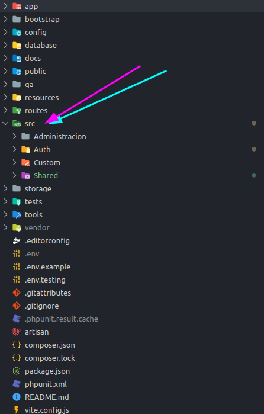
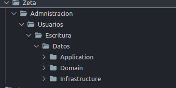
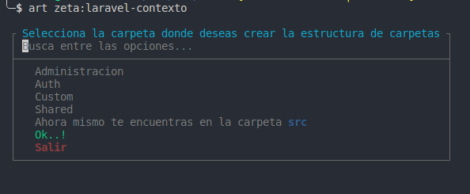
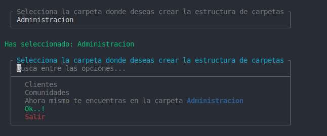
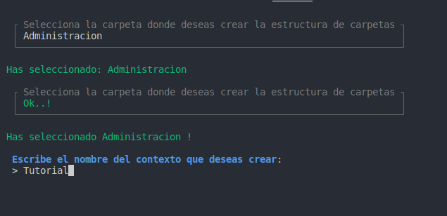
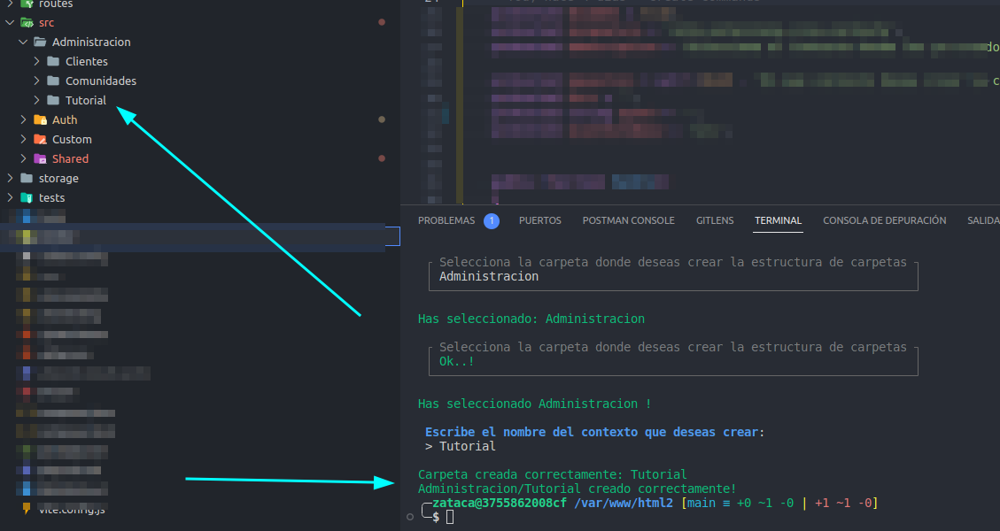

## Laravel Create Scaffold Context Laravel 10.x

## Features

Paquete de [Packagist](https://packagist.org/packages/baezeta/scaffold) para crear la estructura de carpetas *Domain Drive Desing* en tu proyecto Laravel.

# Requerimientos
Tener instalado Laravel  minimo version ```"laravel/framework": "^10.0"```.


# Instalacion

```bash
composer require baezeta/scaffold
```

# Configuracion

Una vez instalado el paquete, necesitaremos incluirlo en el archivo ```Kernel.php``` .
``` App\Console\Kernel::class``` para que pueda ser invocado a traves de **Artisan**
```php
<?php

namespace App\Console;

use Illuminate\Console\Scheduling\Schedule;
use Baezeta\Console\Scaffolding\Context\CreateScaffoldind;
use Illuminate\Foundation\Console\Kernel as ConsoleKernel;

class Kernel extends ConsoleKernel
{
    /**
     * The Artisan commands provided by your application.
     *
     * @var array
     */
    protected $commands = [
        CreateScaffoldind::class,

    ];
}
```

Una vez conofigurado buscara una carpeta principal **src/** que tomara como raiz del proyecto, en caso de no tenerla, crear manualmente para tener una base similar a:




# Formas de Uso

Una vez configurado podemos hacer uso de el con el comando 
```bash
php artisan zeta:crear-contexto 
```
#
## Crear estructura de forma Manual con *Parametro*
El comando acepta un *parametro* como **contexto** para que puedas crear directamente la estructura de carpetas segun tu entrada.

**A tener en cuenta es que los separadores de carpetas tendran que ser el mismo en el comando lanzado**

El comando acepta los siguientes separadores en la entrada del **parametro**
```php
protected array $separadores = ["\\", "/", ".", " ", "_", "-"];
```

```bash
php artisan zeta:crear-contexto Zeta.admnistracion.usuarios.escritura.datos

Carpeta creada correctamente: Zeta
Carpeta creada correctamente: Admnistracion
Carpeta creada correctamente: Usuarios
Carpeta creada correctamente: Escritura
Carpeta creada correctamente: Datos
Zeta/Admnistracion/Usuarios/Escritura/Datos creado correctamente!
```



Tambien podras usarlo sin pasarle **parametro** en el comando y la consola te guiara en la eleccion de las carpetas disponibles.

#
## Crear estructura de forma Interactiva a traves de la *Consola*

```bash
php artisan zeta:crear-contexto 
```










Espero que te sea de utlidad esta pprimera version del 
[paquete](https://github.com/ferbaeza/Laravel-Context-Scaffolding).


<div align="center">
    <a href="https://github.com/ferbaeza/Laravel-Context-Scaffolding">
    
    </a>
</div>


<p align="center">
    <a href="https://packagist.org/packages/baezeta/scaffold"></a>
    <a href="https://packagist.org/packages/baezeta/scaffold"></a>
    <a href="https://packagist.org/packages/baezeta/scaffold"></a>
</p>


**Fernando Baeza**
*fbaezahurtado@gmail.com* o 
*baezacode@gmail.com*